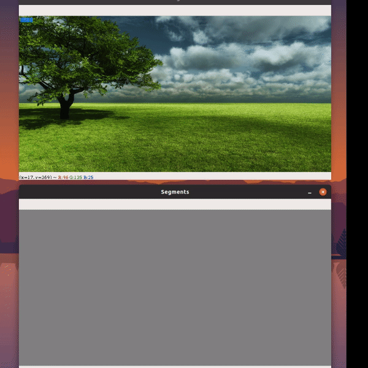

# Wateshed Algorithm with Custom Seed

Watershed is a transformation on grayscale images. The aim of this technique is to segment the image, typically when two regions-of-interest are close to each other — i.e, their edges touch.

This technique of transformation treats the image as a topographic map, with the intensity of each pixel representing the height. For instance, dark areas can be intuitively considered to be ‘lower’ in height, and can represent troughs. On the other hand, bright areas can be considered to be ‘higher’, acting as hills or as a mountain ridge.  

### Watershed by flooding  
Assume that a source of water is placed in the catchment basins — the areas with low intensity. These basins are flooded and areas where the floodwater from different basins meet are identified. Barriers in the form of pixels are built in these areas. Consequently, these barriers act as partitions in the image, and the image is considered to be segmented.

### Custom Seed  

Watershed algorithms takes seeds to segment images. In this implementation you can provide seed for segmenting image by clicking on different part of image(click on parts that your consider different entities like trees, road, etc)

## Requirement
* Programming Language: **Python**

* Python modules
  * **numpy**
  * **opencv**
  * **matplotlib**

## Usage
* Change the path of the image **(Line 9)**  
`image = cv2.imread('/mnt/488266AE8266A064/Images/nature4.jpg')`
* Run code by  `python segmentation.py`
* Click on different parts of the image to provide seed
* Segment having same color will be grouped together. Press **0-9** to change color. (Keep Track of current color by looking at top left corner of image)
* Press **c** to remove all the seed.  

  

  

